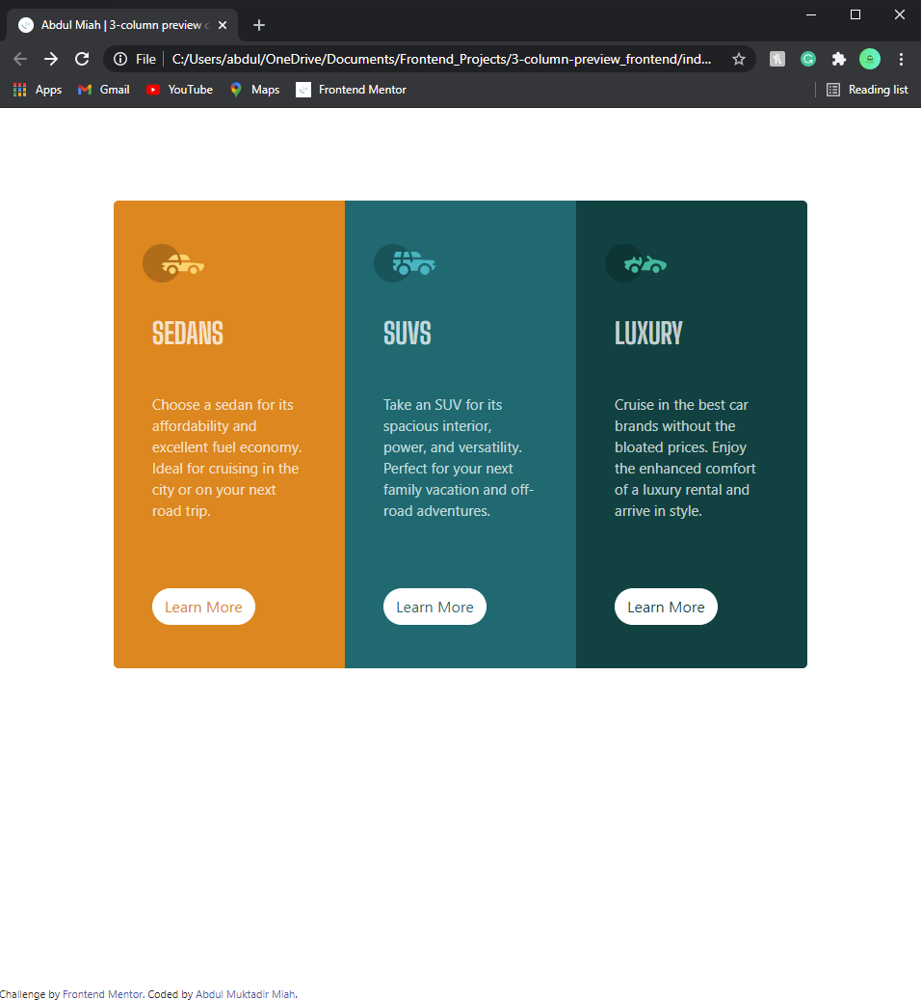
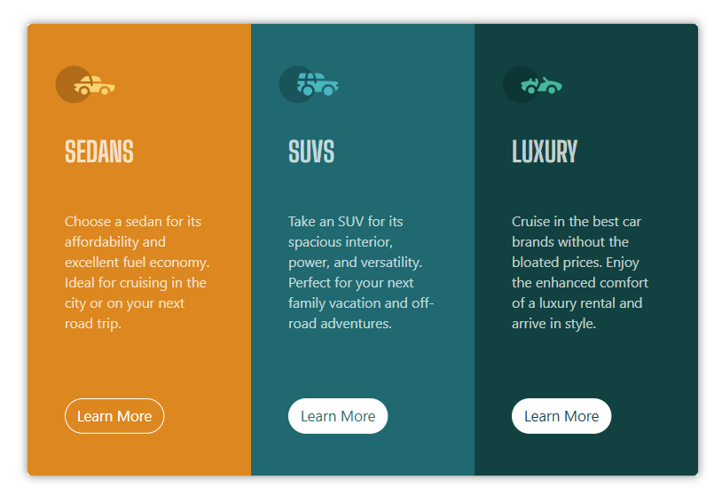
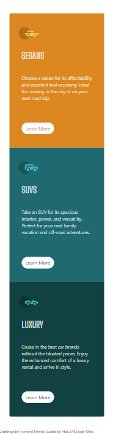

# Frontend Mentor - 3-column preview card component solution

This is a solution to the [3-column preview card component challenge on Frontend Mentor](https://www.frontendmentor.io/challenges/3column-preview-card-component-pH92eAR2-). Frontend Mentor challenges help you improve your coding skills by building realistic projects.


## Table of contents

- [Overview](#overview)
  - [The challenge](#the-challenge)
  - [Screenshot](#screenshot)
  - [Links](#links)
- [My process](#my-process)
  - [Built with](#built-with)
  - [What I learned](#what-i-learned)
  - [Continued development](#continued-development)
  - [Useful resources](#useful-resources)
- [Author](#author)
- [Acknowledgments](#acknowledgments)

**Note: Delete this note and update the table of contents based on what sections you keep.**

## Overview

### The challenge

Users should be able to:

- View the optimal layout depending on their device's screen size
- See hover states for interactive elements

### Screenshot For My Attempt

- Desktop View




- Learn More Button Hover




- Mobile View





<!-- ### Links

- Solution URL: [Add solution URL here](https://your-solution-url.com)
- Live Site URL: [Add live site URL here](https://your-live-site-url.com) -->

## My process

### Built with

- Semantic HTML5 markup
- CSS custom properties
- Bootstrap - Grid

### What I learned

For CSS, I learnt that you can change CSS styles according to the width of the browser window. I used this to change the style of the border. Look at code snippet below:

```css
@media (max-width: 575px) {
  .sedans-col {
    border-radius: 5px 5px 0 0;
  }
}
```


### Continued development

In the future, I could focus on adding more elements/items for the background. At the moment, the background is white and plain, and I could have added extra elements to make it more interesting. This will help me improve my creativity and in the future, I could tackle projects with a more creative/innovative approach.


### Useful resources

- [@media query](https://stackoverflow.com/questions/21075983/how-to-use-particular-css-styles-based-on-screen-size-device/45695130) - This helped me for changing CSS styles based on screen size on device. I really liked this CSS query and will use it going forward.
- [Bootstrap Grid](https://getbootstrap.com/docs/5.0/layout/grid/) - This is an amazing library which helped me implement a responsive design. I'd recommend it to anyone who wants to make their website responsive.


## Author

- Frontend Mentor - [@AbdulMiah](https://www.frontendmentor.io/profile/AbdulMiah)
<!-- - Twitter - [@yourusername](https://www.twitter.com/yourusername) -->
